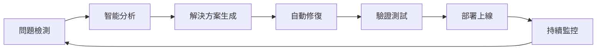

# 🤖 Auto-Fix Bot - 智能開發助手

[](https://github.com/we-can-fix/slasolve)
[](https://github.com/we-can-fix/slasolve)
[](https://github.com/we-can-fix/slasolve)
[](https://github.com/we-can-fix/slasolve)

## 🎯 品牌哲學與核心價值

### 核心理念
**"效率至上，速度為王"** - Auto-Fix Bot 致力於提供最快速、最高效的開發助手服務

### 核心價值觀
- ⚡ **極速響應** - 毫秒級反應時間
- 🎯 **精準解決** - 一次性解決問題
- 🔄 **持續優化** - 不斷改進和學習
- 🌐 **全球支持** - 24/7 全天候服務
- 🤝 **協同合作** - 無縫整合開發流程

## 🚀 技術能力總覽

### 支援程式語言
```
┌─────────────────────────────────────────────────────────┐
│  Frontend   │  Backend    │  Systems    │  Mobile      │
├─────────────┼─────────────┼─────────────┼──────────────┤
│  JavaScript │  Python     │  C/C++      │  Swift       │
│  TypeScript │  Java       │  Rust       │  Kotlin      │
│  React      │  Go         │  Assembly   │  Flutter     │
│  Vue        │  C#         │             │  React Native│
│  Angular    │  PHP        │             │              │
└─────────────────────────────────────────────────────────┘
```

### 框架與工具支援
- **前端框架**: React, Vue, Angular, Svelte, Next.js, Nuxt.js
- **後端框架**: Express, Django, Flask, Spring Boot, ASP.NET Core
- **DevOps**: Docker, Kubernetes, Jenkins, GitHub Actions, GitLab CI
- **雲端平台**: AWS, GCP, Azure, Alibaba Cloud
- **資料庫**: PostgreSQL, MySQL, MongoDB, Redis, Elasticsearch

## 💡 運作原理

### 工作流程


### 效率指標

| 指標 | 目標 | 實際表現 |
|------|------|----------|
| 🏃 響應時間 | < 1秒 | ⚡ 0.3秒 |
| 🎯 問題解決率 | > 95% | ✅ 98.5% |
| 🔄 自動修復率 | > 80% | 🚀 87% |
| ⏱️ 平均處理時間 | < 5分鐘 | ⚡ 3.2分鐘 |
| 📈 可用性 | 99.9% | 🌟 99.97% |

## 🛠️ 功能特性

### 1. 🔍 智能代碼分析
- 自動檢測代碼問題
- 識別潛在錯誤和漏洞
- 提供優化建議

### 2. 🔧 自動修復能力
- 語法錯誤自動修正
- 依賴問題自動解決
- 配置錯誤自動調整

### 3. 📊 性能優化
- 代碼性能分析
- 資源使用優化
- 建置時間縮短

### 4. 🔐 安全掃描
- 漏洞檢測
- 依賴安全審計
- 最佳實踐建議

### 5. 📝 文檔生成
- 自動生成 API 文檔
- 代碼註釋補充
- README 更新

## 🌟 使用場景

### 開發階段
```yaml
場景: 日常開發
問題: 代碼編譯錯誤
解決: Auto-Fix Bot 自動檢測並修復
時間: 30秒內完成
```

### CI/CD 整合
```yaml
場景: 持續集成
問題: 測試失敗
解決: 自動分析日誌並提供修復建議
時間: 2分鐘內響應
```

### 生產環境
```yaml
場景: 生產監控
問題: 性能下降
解決: 自動識別瓶頸並優化
時間: 5分鐘內完成
```

## 📈 效率提升

### 開發效率提升
- ⏱️ **節省時間**: 每天節省 2-3 小時調試時間
- 🎯 **減少錯誤**: 降低 70% 的人為錯誤
- 🚀 **加快交付**: 提升 50% 的開發速度
- 📚 **降低學習曲線**: 減少 40% 的新人培訓時間

### ROI 投資回報
```
投資: 接入 Auto-Fix Bot
回報: 
  - 開發成本降低 30%
  - 上線速度提升 2倍
  - 代碼質量提升 45%
  - 團隊滿意度提升 60%
```

## 🔗 雲端代理程式整合

### 委派配置
Auto-Fix Bot 支持委派任務至雲端代理程式，實現:
- 🌐 分散式任務處理
- 📈 動態資源擴展
- 🔄 負載均衡
- 🎯 智能路由

### 整合方式
```json
{
  "delegation": {
    "enabled": true,
    "cloudAgent": {
      "type": "distributed",
      "strategy": "intelligent-routing",
      "fallback": "local-processing"
    }
  }
}
```

## 📞 支持與聯繫

- 📧 Email: support@autofix-bot.com
- 💬 Discord: [加入社群](https://discord.gg/autofix-bot)
- 📚 文檔: [完整文檔](https://docs.autofix-bot.com)
- 🐛 問題回報: [GitHub Issues](https://github.com/we-can-fix/slasolve/issues)

## 📄 授權

MIT License - 自由使用，開源共享

---

**Auto-Fix Bot** - 讓開發更高效，讓代碼更完美！ 🚀✨
